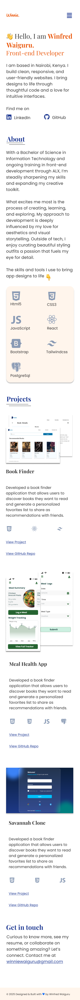

# My Developer Portfolio

This is my personal portfolio website built with **React** and **Tailwind CSS**.  
It highlights my skills, projects, and a bit about me.



## Features

- Responsive design for desktop, tablet, and mobile
- Clean UI with Tailwind CSS
- Sections for **About Me**, **Skills**, **Projects**, and **Contact**
- Easy navigation and smooth user experience

## Tech Stack

- **Frontend**: React, Tailwind CSS
- **Deployment**: Vercel
- **Other Tools**: Figma

## Getting Started

To run this project locally:

```bash
# Clone the repository
git clone https://github.com/Winnie-Waiguru/Winfred-portfolio.git

# Navigate into the project directory
cd  Winfred-portfolio

# Install dependencies
npm install

# Start the development server
npm run dev
```
